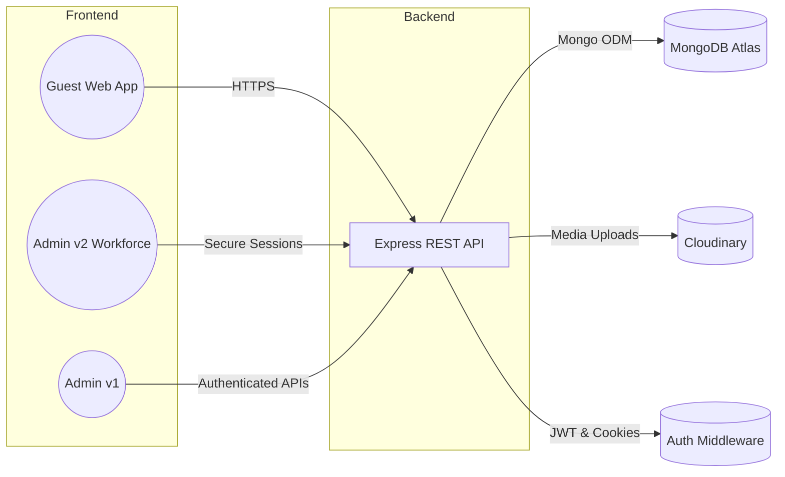

# 🏨 StayVista — Hyper-Personalised Hospitality OS

<div align="center">


**Craft ultra-luxury guest journeys, orchestrate multi-property operations, and unlock revenue intelligence from a single platform.**

[](https://reactjs.org/)
[](https://nodejs.org/)
[](https://www.mongodb.com/atlas)
[](https://expressjs.com/)
[](https://mui.com/)
[](https://vitejs.dev/)
[](https://tailwindcss.com/)
[](https://cloudinary.com/)

[Project Story](#-vision--brand) • [Feature Map](#-platform-capabilities) • [Quick Start](#-quick-start) • [Architecture](#-solution-architecture) • [DX Toolkit](#-developer-experience-toolkit) • [Deployments](#-deployment-playbook)

</div>

---

## 📌 Overview

- **Luxury guest web app (`client/`)** with curated collections, concierge storytelling, and seamless bookings.
- **Next-gen admin workspace (`admin_v2.0/`)** delivering live revenue telemetry, transaction intelligence, and portfolio management.
- **Legacy dashboard (`admin_v1.0/`)** retained for teams migrating gradually.
- **Modular Express API (`api/`)** with hardened middleware, analytics aggregations, and Cloudinary-powered media ops.

> **What’s new?** Transaction health dashboards, inline analytics summaries, enriched single-resource views, and consistent error messaging across login and invitation flows.

---

## 🧭 Table of Contents

- **[Vision & Brand](#-vision--brand)**
- **[Platform Capabilities](#-platform-capabilities)**
- **[Solution Architecture](#-solution-architecture)**
- **[Technology Stack](#-technology-stack)**
- **[Quick Start](#-quick-start)**
- **[Environment Setup](#-environment-setup)**
- **[Module Deep Dive](#-module-deep-dive)**
- **[API Surface](#-api-surface)**
- **[Security & Reliability](#-security--reliability)**
- **[Performance Toolkit](#-performance-toolkit)**
- **[Developer Experience Toolkit](#-developer-experience-toolkit)**
- **[Deployment Playbook](#-deployment-playbook)**
- **[Contributing](#-contributing)**
- **[License & Credits](#-license--credits)**

---

## 🎨 Vision & Brand

StayVista is built for hospitality teams who obsess over ritual-driven guest experiences. Every screen adheres to a **calm, editorial aesthetic** with:

- **Signature storytelling** in landing flows (`client/src/pages/home/Home.jsx`).
- **Premium typographic rhythm** and cinematic photography to set a luxury tone.
- **Human-led concierge prompts** that echo the brand’s “always-on” service philosophy.

---

## 🚀 Platform Capabilities

- **Guest Experience OS**
  - Editorial discovery galleries, lifestyle collections, and dynamic availability (`client/`).
  - Secure booking pipeline backed by real-time room statuses, transaction history, and improved signup affordances (see `client/src/pages/register/Register.jsx`).
- **Operations Control Tower**
  - `admin_v2.0/` surfaces instant KPIs, booking funnels, transaction health, and enriched single-record management (`admin_v2.0/src/pages/single/Single.jsx`).
  - Role-aware workflows for hotel admins, super admins, and concierge teams with refined invite flows and adaptive error messaging (`admin_v2.0/src/pages/new/New.jsx`, `admin_v2.0/src/pages/login/Login.jsx`).
- **Revenue Intelligence**
  - Aggregated analytics via `/api/analytics/summary` combine bookings, transactions, and performance baselines (`api/controllers/analytics.controller.js`).
  - Automated classification of booking and payment states for accurate dashboards and transaction normalization (`admin_v2.0/src/pages/transactions/Transactions.jsx`).
- **Media & Content Engine**
  - Cloudinary-backed uploads for hotels and rooms with curated asset guidelines (`api/routes/uploads.routes.js`).
  - Inline gallery management and availability mapping for rooms (`admin_v2.0/src/pages/single/Single.jsx`).

---

## 🏗️ Solution Architecture



Project layout:

```
StayVista/
├── client/          # Guest-facing React 18 SPA
├── admin_v1.0/      # Legacy admin experience (React 17)
├── admin_v2.0/      # Modern admin workspace (React 19 + Vite + Tailwind)
└── api/             # Express API with analytics, bookings, media, RBAC
```

---

## 🧰 Technology Stack

- **Frontend**
  - `client/`: React 18, React Router 6, custom design system, Axios.
  - `admin_v2.0/`: React 19 + Vite, MUI 7, Tailwind utility layer, Recharts 3, resilient API hooks.
  - `admin_v1.0/`: React 17 + CRA, MUI 5, Recharts 2 (maintained for backwards compatibility).
- **Backend (`api/`)**
  - Node.js (ESM), Express 4.18, Mongoose ODM, modular controllers.
  - System middleware: JWT auth, CORS with credentials, cookie parsing, Multer uploads, Cloudinary SDK.
- **Data & Ops**
  - MongoDB Atlas clusters, Cloudinary CDN, environment-driven configuration, nodemon for DX.

---

## ⚡ Quick Start

```bash
git clone https://github.com/yourusername/stayvista.git
cd StayVista
```

### 1. API Service (`api/`)

```bash
cd api
npm install
cp .env.example .env
# set Mongo, JWT, Cloudinary credentials
npm run start
```

### 2. Guest App (`client/`)

```bash
cd ../client
npm install
cp .env.example .env
npm start            # launches on http://localhost:3000
```

### 3. Admin v2 Workspace (`admin_v2.0/`)

```bash
cd ../admin_v2.0
npm install
cp .env.example .env
npm run dev          # vite server on http://localhost:5173 (default)
```

### 4. (Optional) Legacy Admin v1 (`admin_v1.0/`)

```bash
cd ../admin_v1.0
npm install
cp .env.example .env
npm run dev          # CRA dev server on http://localhost:3001
```

> **Tip:** Run each module in its own terminal. All UIs target the API base URL defined in their respective `.env` files.

---

## 🔐 Environment Setup

- Copy `api/.env.example`, `client/.env.example`, `admin_v2.0/.env.example`, and `admin_v1.0/.env.example` before booting services.
- Required keys:
  - `MONGO`, `JWT`, `JWT_SECRET`, `PORT`, `CLIENT_URL`, `ADMIN_URL` (`api/.env`).
  - `VITE_API_BASE_URL` for `admin_v2.0/` (fallbacks to `/api`).
  - `REACT_APP_API_URL` for `client/` and `admin_v1.0/`.
- Recommended extras: enable Cloudinary credentials for media uploads and configure `NODE_ENV` for production logging control.

---

## 🔍 Module Deep Dive

- **Guest Web Application (`client/`)**
  - Immersive hero experiences, lifestyle-based property curation, property grids, editorial storytelling, and responsive design.
  - Booking flow integrates real-time availability, rate filters, and transaction history views.
  - Signup and onboarding tuned with consistent form placeholders and validation hints (`client/src/pages/register/Register.jsx`).
- **Admin Workspace v2 (`admin_v2.0/`)**
  - Protected routes via `AuthContext` (`admin_v2.0/src/App.jsx`).
  - Advanced stats: daily revenue, booking mix, transaction health, and 6-month revenue trends.
  - Data toolbelt with logs, bookings, transactions, hotels, rooms, and user management panels, plus deep single-resource editing experiences (`admin_v2.0/src/pages/single/Single.jsx`).
  - Consistent error extraction and login safeguards using `extractApiErrorMessage()` (`admin_v2.0/src/pages/login/Login.jsx`).
- **Admin Dashboard v1 (`admin_v1.0/`)**
  - Original Material UI + SASS dashboard; preserved for teams that still rely on legacy workflows.
- **API Service (`api/`)**
  - Route map: `/api/auth`, `/api/users`, `/api/hotels`, `/api/rooms`, `/api/upload`, `/api/bookings`, `/api/transactions`, `/api/analytics`.
  - `api/index.js` enforces environment validation, proxy trust, and centralized error handling.
  - Analytics controller computes aggregate metrics and same-day revenue lifts.

---

## 📚 API Surface

- **Authentication**
  - `POST /api/auth/register`
  - `POST /api/auth/login`
- **Hotels & Rooms**
  - CRUD endpoints with admin guardrails (`verifyAdmin`).
  - Media upload endpoints: `POST /api/upload/hotels` and `POST /api/upload/rooms`.
- **Bookings & Transactions**
  - `GET /api/bookings` with filter support, booking status transitions, and transaction audit trails.
  - `GET /api/transactions` with sorting, status normalization, and revenue aggregation.
- **Analytics**
  - `GET /api/analytics/summary` consolidates user, hotel, booking, transaction, and revenue streams.

> See `admin_v2.0/src/pages/transactions/Transactions.jsx` for the latest row normalization logic powering resilient dashboards.

---

## 🛡️ Security & Reliability

- Stateless JWT authentication + signed cookies.
- Role-based guards for admin-only surfaces and critical mutations.
- Input validation, safe file handling, and defensive error responses.
- CORS configuration tuned per client/admin domain via `CLIENT_URL` and `ADMIN_URL` env keys.
- Graceful MongoDB connection handling with disconnect resilience.

> Authentication flows leverage trimmed and sanitized identifiers, ensuring safe login experiences across email, phone, and username inputs (`admin_v2.0/src/pages/login/Login.jsx`).

---

## ⚙️ Performance Toolkit

- Code-splitting and lazy routing for guest & admin apps.
- Cloudinary transformations for responsive image delivery.
- Indexed MongoDB collections with aggregation pipelines for analytics.
- Vite-driven HMR (admin v2) and minimal bundles for runtime efficiency.

> Transaction grids debounce re-rendering through memoized column definitions and height virtualization, keeping KPI tables fluid under load (`admin_v2.0/src/pages/transactions/Transactions.jsx`).

---

## 🧑‍💻 Developer Experience Toolkit

- **Linting & Formatting**
  - Admin workspace: `npm run lint` (ESLint flat config in `admin_v2.0/eslint.config.js`).
  - Auto-fix: `npm run lint -- --fix` for rapid hygiene passes.
  - Prettier formatting aligned across modules; configure editors to respect `.editorconfig`.
- **Testing & Validation**
  - Targeted integration via Postman collections (`api/collections/`) or Thunder Client.
  - Manual smoke tests: login, invite user, create hotel, create room, capture transaction.
- **Debugging helpers**
  - `extractApiErrorMessage()` centralizes API error parsing (`admin_v2.0/src/utils/error.js`).
  - Session messaging utilities (`admin_v2.0/src/utils/session.js`) preserve toasts across redirects.
- **Recommended VS Code Extensions**
  - ESLint, Tailwind CSS IntelliSense, GitLens, Thunder Client, and REST Client for API exploration.
- **Scripts Recap**
  - `npm run dev` → Vite dev server with fast HMR.
  - `npm run build` → Production bundle, outputs to `dist/`.
  - `npm run preview` → Local preview of production build.

---

## 🚀 Deployment Playbook

- **API (`api/`)**
  - Target Node 18+ environment (Render, Railway, or AWS Elastic Beanstalk).
  - Configure environment variables: `MONGO_URI`, `JWT_SECRET`, `CLIENT_URL`, `ADMIN_URL`, `CLOUDINARY_*` keys.
  - Enable automated backups for MongoDB Atlas; leverage Vercel/Netlify edge for web caching.
- **Admin v2 (`admin_v2.0/`)**
  - Build with `npm run build`; deploy `dist/` to Vercel, Netlify, or Cloudflare Pages.
  - Set `VITE_API_BASE_URL` to the API origin. Use environment-specific values for staging/production.
  - Consider password-protecting staging environments via edge middleware.
- **Client (`client/`)**
  - CRA-style build (`npm run build`) deployable to Netlify, Vercel, or static S3 hosting.
  - Ensure `REACT_APP_API_URL` aligns with API base and includes HTTPS.
- **Legacy Admin (`admin_v1.0/`)**
  - Optional deployment for teams needing the historical experience; treat as maintenance mode.
- **Observability**
  - Recommend integrating Logtail/DataDog for API logs, Vercel Analytics for frontend, and MongoDB Atlas metrics.
  - Configure uptime checks for `/api/health` and `/api/analytics/summary` endpoints.

---

## 🤝 Contributing

We’re excited to collaborate with engineers, designers, and revenue strategists.

1. **Fork** and clone the repo.
2. **Create** a feature branch: `git checkout -b feature/improve-analytics`.
3. **Commit** with clear narratives: `git commit -m "feat: surface booking funnel"`.
4. **Push** `git push origin feature/improve-analytics`.
5. **Open** a pull request describing context, screenshots, and validations.

Refer to `CONTRIBUTING.md` for coding standards and review tips.

---

## 📄 License & Credits

- Licensed under **MIT** — see [`LICENSE`](./LICENSE).
- Crafted by [Utkarsh V](https://github.com/uvongit) with contributions from the StayVista engineering guild.
- Thanks to React, Material UI, MongoDB, Cloudinary, and the wider open-source community powering modern hospitality tech.

<div align="center">

**Built with ❤️ to elevate every stay.**

[Back to Top](#-stayvista--hyper-personalised-hospitality-os)

</div>
